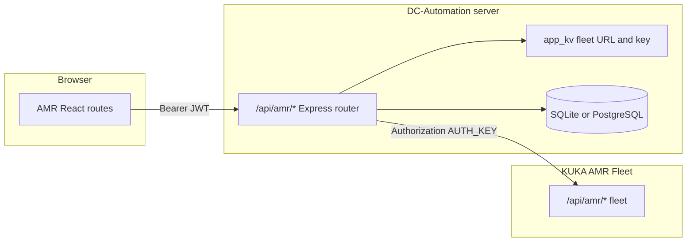

# Reference AMR module (KUKA Fleet APIs)

## Goals and constraints

- **Product spec**: [docs/AMR/.AMR Module.md](docs/AMR/.AMR%20Module.md) — dashboard, missions (create + monitor), robots, containers, logs, positions/stands, settings; mobile-friendly; match existing module layout/design; granular permissions where the doc calls for them.
- **API spec**: [docs/AMR/AMR APIs.md](docs/AMR/AMR%20APIs.md) — `submitMission`, `missionCancel`, `operationFeedback`, `robotQuery`, `jobQuery`, `containerIn`, `containerOut`, `containerQuery`, `containerQueryAll` (doc mis-labels one section as “ContainerOut”; URL is `containerQuery` / `containerQueryAll`).
- **Security**: Store **fleet connection + API key only on the server** (see [AMR Settings page](#amr-settings-page-fleet-connection)). Browser calls DC-Automation `/api/amr/...` with JWT only; the fleet `Authorization` header is applied exclusively on the server when forwarding to `http://<SERVER_IP>:<SERVER_PORT>/api/amr/...` per [docs/AMR/AMR APIs.md](docs/AMR/AMR%20APIs.md).

## PostgreSQL and SQLite (required)

DC-Automation supports **either** database via [server/db/index.ts](server/db/index.ts): PostgreSQL when `DATABASE_URL` (or config) is set (`initSchemaPg`), else SQLite (`initSchema`). AMR persistence **must be implemented in both paths**, matching the rest of the codebase.

| Area | SQLite | PostgreSQL |
|------|--------|------------|
| Schema / migrations | [server/db/schema.ts](server/db/schema.ts) — `CREATE TABLE` / incremental migrations in `initSchema` | [server/db/schema-pg.ts](server/db/schema-pg.ts) — add `CREATE TABLE IF NOT EXISTS` to `BASELINE_PG_STATEMENTS` **or** idempotent `ALTER`/`CREATE INDEX` lines to `PG_POST_BASELINE_STATEMENTS` (same comment block: applied on PG startup **and** by migrate script) |
| Runtime access | `AsyncDbWrapper` via better-sqlite3 wrapper | `createPgPoolWrapper` in [server/db/pg.ts](server/db/pg.ts) — SQL uses `?` placeholders; wrapper maps to PG `$1…` via [server/db/sqlPlaceholders.ts](server/db/sqlPlaceholders.ts) |
| One-time data copy | N/A | [scripts/migrate-sqlite-to-pg.ts](scripts/migrate-sqlite-to-pg.ts) — extend `TABLE_ORDER` with new AMR tables in **foreign-key-safe order** (e.g. `amr_stands` → `amr_mission_records` → `amr_mission_status_log` if FKs exist) so installs that move SQLite → PG do not lose AMR data |

**AMR tables** (names illustrative): stands, mission records, append-only status log. Use TEXT/TIMESTAMP patterns consistent with existing PG baseline (see `tsTextDefault` in [server/db/schema-pg.ts](server/db/schema-pg.ts)). Add indexes for common queries (`job_code`, `created_at`, `mission_record_id`).

**Fleet settings** use existing `app_kv` (already in both DB baselines), e.g. one JSON key like `amr.fleet.config` holding IP, port, auth key reference fields (see below).

### AMR Settings page (fleet connection)

Dedicated **`/amr/settings`** route (permission `amr.settings` or `module.amr` + nested rule — align with [Phase 2](#phase-2--permissions-and-role-catalog)). This page is **not** the global Admin Settings app; it is module-local configuration matching [.AMR Module.md](docs/AMR/.AMR%20Module.md).

**Required UI fields (fleet HTTP endpoint per AMR APIs)**

| Field | Purpose |
| --- | --- |
| **Server IP** (or hostname) | `SERVER_IP` in the docs — host segment only (no protocol, no path). Accept IPv4, IPv6 (bracketed in URL builder), or DNS name. |
| **Server port** | `SERVER_PORT` — numeric port for the fleet HTTP API (default e.g. `80` or whatever your fleet uses; validate 1–65535). |
| **Auth key** | Value sent as HTTP header `Authorization: <auth_key>` on every fleet POST (docs label this `AUTH_KEY`). |

**Derived URL (implementation detail, not a separate user-facing field unless you want “advanced” later):** base URL `http://${server_ip}:${server_port}` → fleet paths `/api/amr/submitMission`, `/api/amr/jobQuery`, etc. **HTTPS/TLS**: if production fleets require `https`, either add an explicit **Use HTTPS** checkbox that switches the scheme or document env-only override — decide at implementation time; the AMR doc examples use `http://`.

**Auth key UX and API behavior**

- **GET** settings: return `server_ip`, `server_port`, `auth_key_configured` (boolean). Do **not** return the raw auth key (mirror patterns like masked secrets elsewhere in the app, if any).
- **PUT/PATCH**: accept optional `auth_key` — if the client sends a non-empty string, replace stored key; if omitted or empty, keep existing key (avoid wiping on partial saves).
- Optional: **“Test connection”** button calling a lightweight fleet endpoint (e.g. `robotQuery` with empty filters) and surfacing success/errors on the settings page.

**Additional module defaults on the same page (same doc / workflow)**

Keep on Settings or a collapsible “Mission defaults” section: `orgId`, default `robotType`, `robotModels[]`, default `containerType` / `containerModelCode`, poll intervals for missions / robots / containers (seconds), consistent with [docs/AMR/AMR APIs.md](docs/AMR/AMR%20APIs.md) JSON options.

### Polling strategy (when fleet calls run)

**Client-side only (robots, containers, dashboard browsing, general mission lists)**

- Pages that show fleet-wide or exploratory data (`robotQuery`, `containerQuery` / `containerQueryAll`, “all active jobs” lists, dashboard tiles) use in-browser polling **only while that route is mounted**; clear timers on unmount.
- Intervals from module settings (robots vs containers vs UI refresh for lists).
- **Optional:** pause when the tab is hidden (`document.visibilityState`) and resume when visible.

**Server-side only for missions created by this app (required)**

- Run a **background loop in the DC-Automation Node process** (same pattern family as existing scheduled work in [server/index.ts](server/index.ts)) that **only** considers missions recorded as originating from this module — e.g. rows in `amr_mission_records` with **non-terminal** job status (not Complete / Cancelled / etc. per [job status codes](docs/AMR/AMR%20APIs.md)).
- On each tick (interval from settings, e.g. same default as mission poll seconds): for each such mission, call fleet **`jobQuery`** with that `jobCode`; optionally **`containerQuery`** if needed for detail; **append** new statuses to `amr_mission_status_log`.
- When status becomes **complete** (and any other terminal rules you define): if the workflow requires **removing the container from the map** per [.AMR Module.md](docs/AMR/.AMR%20Module.md) / persistence flags, invoke fleet **`containerOut`** at the **final stop** position; update the mission row as finalized; stop tracking that job in the server loop.
- **Scope boundary:** this server poller **does not** poll the entire fleet for unrelated jobs — only **app-generated** missions that are still open in `amr_mission_records`. External/fleet-only missions are never touched by the server loop.

**UI + server together**

- The Missions UI can still **poll or refetch** while open for instant feedback; **authoritative completion and `containerOut`** should rely on the **server monitor** so cleanup happens even if the user closes the browser. Avoid duplicate `containerOut` calls (idempotent checks: only fire when transitioning to completed and policy says remove).

**Explicitly out of scope for server polling**

- No 24/7 server polling for generic fleet discovery (all robots / all containers / every active job worldwide) — those stay client-mounted only.

## Phase 1 — Module shell and fleet proxy

- **Paths**: `AMR_PREFIX`, `amrPath()` in [src/lib/appPaths.ts](src/lib/appPaths.ts).
- **Module registration**: [src/config/modules.ts](src/config/modules.ts); [src/components/home/HomeModuleCardIcon.tsx](src/components/home/HomeModuleCardIcon.tsx).
- **Routing**: [src/App.tsx](src/App.tsx) — `amrLayout`, lazy routes (dashboard, missions, robots, containers, logs, stands, settings, **`/amr/tools/api-playground`** — [In-app API playground](#2-in-app-api-playground)).
- **PermissionGuard**: [src/components/auth/PermissionGuard.tsx](src/components/auth/PermissionGuard.tsx) — fallback to `/amr` when user has `module.amr` only.
- **Sidebar**: [src/components/layout/Sidebar.tsx](src/components/layout/Sidebar.tsx) — AMR nav + touch-friendly links; include **API Playground** link (same permission as playground — see below) so it is discoverable next to Settings/Tools.
- **Server**: New router mounted in [server/index.ts](server/index.ts); internal path namespace distinct from upstream fleet (e.g. `/api/amr/dc/...` → forwards to fleet `/api/amr/submitMission`, etc.).
- **Fleet client**: Resolve base URL from stored `server_ip` + `server_port`; attach header `Authorization` from stored **auth_key**; server-only `fetch`, 30s timeout, forward `success`/`code`/`message`/`data`.
- **Settings API**: GET/PUT for [AMR Settings page](#amr-settings-page-fleet-connection) under the same router (permission-gated); persist via `app_kv`.
- **Mission completion worker**: start/stop with app lifecycle — interval driven by settings; processes only [app-generated missions](#polling-strategy-when-fleet-calls-run) until terminal + optional `containerOut`.

## Phase 2 — Permissions and role catalog

- [src/lib/permissionsCatalog.ts](src/lib/permissionsCatalog.ts), [server/lib/permissionsCatalog.ts](server/lib/permissionsCatalog.ts): `module.amr`, nested e.g. `amr.missions.manage`, `amr.stands.manage`, `amr.settings`, **`amr.tools.dev`** (for [API playground](#2-in-app-api-playground)) unless playground is gated solely by `amr.settings`.
- [server/lib/rolePermissions.ts](server/lib/rolePermissions.ts), [server/db/schema.ts](server/db/schema.ts) role backfill, [src/store/authStore.ts](src/store/authStore.ts) dev fallbacks as needed.

## Phase 3 — Data model (stands, missions, logs)

- Implement tables in **both** [server/db/schema.ts](server/db/schema.ts) and [server/db/schema-pg.ts](server/db/schema-pg.ts).
- Update [scripts/migrate-sqlite-to-pg.ts](scripts/migrate-sqlite-to-pg.ts) `TABLE_ORDER` for any new tables with user data.
- Stands CRUD + CSV import via `/api/amr/dc/stands` (permissions as designed).

## Phase 4 — Missions UI (RACK_MOVE / container move)

- IDs: `DCA-RM-…`, `DCA-CN-…`, `DCA-CI-…`, `DCA-CO-…` per [AMR APIs.md](docs/AMR/AMR%20APIs.md).
- Flow: `containerIn` → `submitMission` → record mission in DB → **server worker** drives `jobQuery` until terminal and performs **`containerOut`** when required; UI follows [Polling strategy](#polling-strategy-when-fleet-calls-run). Guard against double `containerOut`.
- `missionCancel`, `operationFeedback` on detail UI.

## Phase 5 — Robots and Containers

- `robotQuery`, `containerQuery` / `containerQueryAll` with `inMapStatus` filters per spec; poll intervals only while those pages are mounted ([Polling strategy](#polling-strategy-when-fleet-calls-run)).

## Phase 6 — Dashboard and Logs

- Aggregates from DB + client fleet queries on dashboard mount / manual refresh; status history populated by **server mission monitor** + client views; logs from append-only status table.

## Phase 7 — Polish

- Sticky / global “New mission”; responsive layout.
- Optional doc fix: duplicate “ContainerOut” heading in [docs/AMR/AMR APIs.md](docs/AMR/AMR%20APIs.md) for `containerQuery`.

## AMR API tester and fleet emulator (separate tool)

Purpose: **develop and debug without always hitting a real KUKA fleet** — validate payloads, headers, and DC-Automation proxy behavior using [docs/AMR/AMR APIs.md](docs/AMR/AMR%20APIs.md) shapes.

### 1. Fleet emulator (mock HTTP server)

- **Standalone process** (e.g. `scripts/amr-fleet-emulator.mjs` or small Express app in `server/dev/`), started via **`npm run`** (document in root `package.json`).
- Listens on **host/port** you choose (e.g. `localhost:8099`); exposes the same paths as the real fleet: `POST /api/amr/submitMission`, `jobQuery`, `robotQuery`, `containerIn`, `containerOut`, `containerQuery`, `containerQueryAll`, `missionCancel`, `operationFeedback`.
- **Auth**: accept any `Authorization` header (or fixed test token) so AMR Settings can point **server_ip** = `127.0.0.1` and **server_port** = emulator port for safe local runs.

**Per-type in-memory stores** (isolated collections — implement each shape per [AMR APIs.md](docs/AMR/AMR%20APIs.md)):

| Type | Source / mutations | Status or fields you must be able to control |
| --- | --- | --- |
| **Jobs** (`jobQuery`, `submitMission`, `missionCancel`, `operationFeedback`) | `submitMission` **creates** a job row keyed by `missionCode` / `jobCode`; cancel/feedback update behavior like the real API | **Job status** codes: Created `10`, Executing `20`, Waiting `25`, Cancelling `28`, Complete `30`, Cancelled `31`, Manual complete `35`, Warning `50`, Startup error `60` |
| **Robots** (`robotQuery`) | Emulator must allow **adding** robots without `robotQuery` — seed via dev routes or control UI (see below) | **Robot status**: Departure `1`, Offline `2`, Idle `3`, Executing `4`, Charging `5`, Updating `6`, Abnormal `7` |
| **Containers** (`containerIn`, `containerOut`, `containerQuery`, `containerQueryAll`) | `containerIn` **creates**; `containerOut` removes or marks deleted per doc; allow **adding** extra fixtures via dev routes | **`inMapStatus`** (`0` / `1`), **`emptyFullStatus`**, **`isCarry`**, orientation strings — match fields returned in sample responses |

**Changing statuses and adding items (emulator-only developer surface)**

- Provide **non-standard routes** on the emulator only (prefix e.g. `/__emulator/` or a separate port for controls — never forward these through DC-Automation prod proxy):
  - **Jobs:** set `jobCode` → job status to any valid code; optionally auto-advance timer for demos.
  - **Robots:** **POST** add robot `{ robotId, robotType?, ...defaults }`; **PATCH** set `status`, position/`nodeForeignCode`, `batteryLevel`, etc.
  - **Containers:** **POST** add container fixture `{ containerCode, nodeCode, inMapStatus?, ... }`; **PATCH** fields; simulate moves by updating `nodeCode`.
- Optionally serve a minimal **control panel** (HTML) at `GET /__emulator/` on the emulator — dropdown per entity type, pick id, set status / add row — so testers need no curl.

**KUKA parity endpoints** (what DC-Automation calls) still return `{ success, code, message, data }` and read/update these stores so **`jobQuery`** reflects whatever status was set, **`robotQuery`** lists seeded robots, **`containerQuery*`** lists seeded containers.

### 1b. Emulator default fixtures

- Seed **one robot**, **one container**, **zero jobs** on startup so `robotQuery` / `containerQuery` are non-empty before first `submitMission`; document how to reset stores (`DELETE /__emulator/reset` or restart process).

### 2. In-app API playground

**Included deliverable** — ship as part of the AMR module, not optional tooling.

- **Canonical route:** **`/amr/tools/api-playground`** (lazy-loaded). Banner or page title makes clear this is **testing / diagnostics**, not operator dispatch.
- **Permission:** dedicated **`amr.tools.dev`** (recommended) **or** `amr.settings` — pick one and register in [permissions catalog](#phase-2--permissions-and-role-catalog); grant only to integrators/admins. Sidebar shows **API Playground** only when permitted.
- **UI (minimum):**
  - Dropdown of fleet operations mapped to DC proxy routes (`submitMission`, `jobQuery`, `robotQuery`, `containerIn`, `containerOut`, `containerQuery`, `containerQueryAll`, `missionCancel`, `operationFeedback`).
  - **JSON editor** for request body (textarea or lightweight code field); **Load example** per endpoint from [AMR APIs.md](docs/AMR/AMR%20APIs.md).
  - **Send** → authenticated request to DC-Automation proxy (same path production uses) → panel showing **HTTP status**, **response JSON** (pretty-printed), **elapsed ms**, and copy-to-clipboard.
  - Optional quality-of-life: history of last N requests (session-only), “clear body”.
- **Target fleet:** follows saved AMR Settings (**server_ip**, **server_port**, **auth_key**); for safe runs point settings at the **[fleet emulator](#1-fleet-emulator-mock-http-server)** (`127.0.0.1` + emulator port).

### 3. Relationship to “Test connection” on Settings

- Settings **Test connection** remains a **one-click smoke check** (e.g. `robotQuery`).
- **Playground + emulator** are the **full interactive** debugging surface for arbitrary payloads and scripted scenarios.

## Out of scope

- Map XML import; “Move robot” mission — future per module doc.

## Testing

- Unit: ID builders, status maps, SQL that runs on both wrappers (or parameterized tests for PG + SQLite in CI when both are covered).
- Integration: point DC-Automation at the **fleet emulator** and run scripted flows (submit → poll → complete); optional CI job that starts emulator + hits proxy (lightweight smoke).
