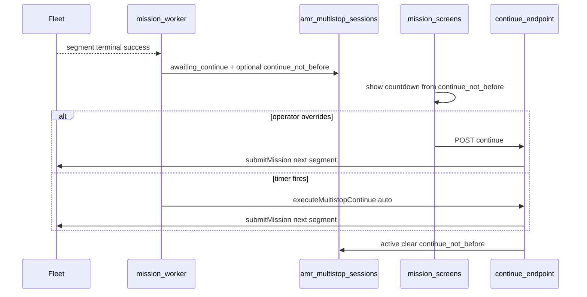

# Multistop per-stop manual vs timed auto-continue

## Requirements (product)

- **Per destination stop:** `continueMode` `'manual'` | `'auto'` — **default `'manual'`** when omitted (backward compatible).
- **Auto:** integer **`autoContinueSeconds` > 0** when mode is auto.
- **App-only:** Fleet `submitMission` / `missionData` stays **`AUTO` / `waitingMillis: 0`** — no fleet-side waiting semantics.
- **Timer on mission screens:** Whenever a multistop session is **`awaiting_continue`** and **`continue_not_before`** is set (auto mode), **show a live countdown** (or time-until-continue) so operators see how long until the next segment starts without opening a modal.
- **Override release:** **Always** show the existing **Continue** (or equivalent **Release now** / **Continue to next stop**) action while waiting; **POST continue** remains the override path and runs immediately, **clearing** the auto deadline when the next segment is submitted. No separate “cancel auto” control required unless UX prefers a redundant label.

## Current behavior (baseline)

- Plan shape: [`server/lib/amrMultistop.ts`](server/lib/amrMultistop.ts). **`parseMultistopPlan` currently overwrites destinations to `AUTO`/`0`**; POST/PATCH in [`server/routes/amr.ts`](server/routes/amr.ts) hard-code the same.
- Segment completes → [`server/lib/amrMissionWorker.ts`](server/lib/amrMissionWorker.ts) sets `awaiting_continue`.
- Advance: `POST /dc/missions/multistop/:sessionId/continue`. UI: [`AmrMissionDetailModal.tsx`](src/components/amr/AmrMissionDetailModal.tsx), [`AmrMultistopSummaryModal.tsx`](src/components/amr/AmrMultistopSummaryModal.tsx), create [`AmrMissionNew.tsx`](src/routes/amr/AmrMissionNew.tsx).

## Design

### 1) `plan_json` per destination

- `continueMode`: `'manual' | 'auto'`
- `autoContinueSeconds`: required when auto; validated (min 1, sensible max, e.g. 86400)

**Which stops:** Waits occur after segments `0 .. total-2` only. **Final destination:** hide/disable release controls (no continue after last stop).

**Index:** When segment `stepIdx` completes, use **`plan.destinations[stepIdx]`**.

### 2) Session column `continue_not_before` (ISO TEXT, nullable)

- Manual wait at current stop: **NULL**
- Auto: set to **now + autoContinueSeconds** when entering `awaiting_continue`
- Clear when leaving `awaiting_continue` (successful continue)
- **PATCH** while waiting: recompute from **`destinations[next_segment_index - 1]`**; reset deadline from **server now** when operator edits delay/mode mid-wait

Migrations: [`server/db/schema.ts`](server/db/schema.ts) + [`server/db/schema-pg.ts`](server/db/schema-pg.ts).

### 3) Worker

- After setting `awaiting_continue`, load `plan_json`, set/clear `continue_not_before`
- In same poll loop, pick sessions with `awaiting_continue` AND `continue_not_before <= now` → **`executeMultistopContinue`** (auto source)

### 4) Extract `executeMultistopContinue`

New module (e.g. [`server/lib/amrMultistopContinue.ts`](server/lib/amrMultistopContinue.ts)): shared by HTTP POST and worker; **`userId`** from session `created_by` for auto; log source `multistop-auto-continue` vs `multistop-continue`.

### 5) API surfaces for UI timer

- **`GET /dc/missions/multistop/:sessionId`:** session includes `continue_not_before`
- **`GET /dc/missions/attention`:** each item includes **`continueNotBefore`** (mapped from column) so **Layout banner / list rows** can render countdown **without** N+1 session fetches

### 6) UI — timer + override (explicit scope)

| Surface | Timer | Override |
|--------|--------|----------|
| [`AmrMissionDetailModal`](src/components/amr/AmrMissionDetailModal.tsx) | Prominent countdown near **Continue to next stop** when `continue_not_before` present | Existing **Continue** remains primary override (copy can clarify **Continue now** vs auto) |
| [`AmrMultistopSummaryModal`](src/components/amr/AmrMultistopSummaryModal.tsx) | Same pattern if session shown in awaiting state | Same |
| [`AmrMissions.tsx`](src/routes/amr/AmrMissions.tsx) | Grouped row / attention highlight: **remaining time** or clock icon + relative time when attention item has deadline | Link/open modal to continue; optional inline **Continue** only if already in scope |
| [`AmrDashboard.tsx`](src/routes/amr/AmrDashboard.tsx) | Recent multistop row: same light countdown when awaiting + auto | Link to missions/detail |
| [`AmrAttentionBanner.tsx`](src/components/amr/AmrAttentionBanner.tsx) | If attention payload includes `continueNotBefore`, show **“Auto-continues in mm:ss”** for those sessions (poll already loads list) | Banner still links to Missions; override remains on mission screen |

**Implementation note:** Use **client-side countdown** from ISO deadline + `setInterval`/`requestAnimationFrame` refresh (1s tick is enough); resync when session/attention refetches.

**Accessibility:** Announce countdown updates sparingly or use `aria-live="polite"` for the timer region only if it does not spam.

### 7) Risk handling

- **Idempotency:** first continue wins; concurrent manual + auto resolves via session status / single flight
- **Double-submit:** existing 409 on wrong session state

## Flow (mermaid)

