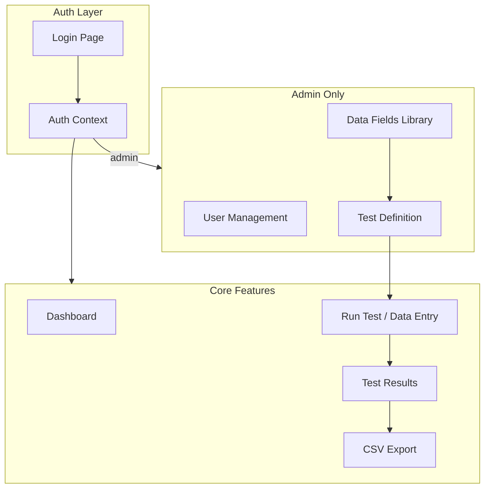

# Automation Testing Web App - Frontend Plan

## Architecture Overview




## Tech Stack

- **React 18** + **Vite** - fast dev experience
- **React Router v6** - routing
- **Tailwind CSS** - styling (responsive, mobile-first, dark mode via `dark:`)
- **Zustand** or **React Context** - auth state + mock data (frontend-only for now)
- **react-hook-form** + **zod** - forms and validation
- **date-fns** - date formatting for CSV export

## Data Models (Frontend-First)

**Data Field** (reusable, statically defined; supports DDL/select with options):

```ts
{
  id: string;
  key: string;        // unique identifier (e.g. "cycle_time_sec")
  label: string;      // display name (e.g. "Cycle Time (sec)")
  type: 'number' | 'text' | 'boolean' | 'datetime' | 'select';
  // type-specific config:
  unit?: string;      // for number
  min?: number; max?: number;  // for number
  options?: string[]; // for select (DDL dropdown options)
  required?: boolean;
}
```

**Test Definition** (references data fields; can add new fields inline when creating):

```ts
{
  id: string;
  name: string;
  description?: string;
  fieldIds: string[];  // ordered list of DataField IDs from library
}
```

When creating/editing a test, the user selects from existing fields and can create new ones directly; new fields are added to the library for reuse.

**Test Run / Collected Data**:

```ts
{
  id: string;
  testId: string;
  runAt: Date;
  enteredBy: string;
  data: Record<string, string | number | boolean>;  // keyed by field key
  status: 'pass' | 'fail' | 'partial';  // derived from field thresholds
}
```

**User** (for admin):

```ts
{ id: string; email: string; role: 'admin' | 'user'; name?: string }
```

## Page Structure


| Route            | Access | Purpose                                                       |
| ---------------- | ------ | ------------------------------------------------------------- |
| `/login`         | Public | Login form                                                    |
| `/`              | Auth   | Dashboard - recent runs, quick actions                        |
| `/fields`        | Admin  | Data fields library - list, create, edit (static definitions) |
| `/tests`         | Auth   | List tests, create new (admin)                                |
| `/tests/:id`     | Auth   | Edit test - select fields from library, create new inline     |
| `/tests/:id/run` | Auth   | Manual data entry form (dynamic from selected fields)         |
| `/results`       | Auth   | List test runs, filter by test/date                           |
| `/results/:id`   | Auth   | Single run detail                                             |
| `/users`         | Admin  | User management (CRUD)                                        |
| `/export`        | Auth   | Export results to CSV (filter, select columns)                |


## Mobile-Friendly Data Collection

The **Test Run** flow (`/tests/:id/run`) and **DynamicDataEntryForm** are optimized for use on phones/tablets in the warehouse:

- **Mobile-first layout** - Single-column form, full-width inputs, large touch targets (min 44px)
- **Responsive typography** - Readable font sizes, adequate spacing on small screens
- **Touch-friendly controls** - Native `<select>` or large custom dropdowns; checkbox/radio with ample hit area; number inputs with `inputmode="decimal"` where appropriate
- **Sticky submit** - Submit button fixed at bottom on mobile so it stays visible while scrolling
- **Viewport meta** - `width=device-width, initial-scale=1` in `index.html`
- **Optional PWA** - Add `manifest.json` + service worker later for "Add to Home Screen" and offline data entry (future enhancement)

Admin pages (test definition, field library, user management, export) can remain desktop-optimized; data collection is the primary mobile use case.

## Data Fields Library & Test Creation

- **Statically defined fields** - Reusable data fields live in a library (`/fields`); each has type (number, text, boolean, datetime, **select**), key, label, and type-specific config
- **Select/DDL fields** - Fields of type `select` have an `options` array defining dropdown choices (e.g. `["Pass", "Fail", "N/A"]`)
- **Test creation flow** - When creating/editing a test, user:
  1. Selects existing fields from the library (searchable list, multi-select, drag to reorder)
  2. Can create new fields inline via "Add new field" - defines key, label, type, and for select: options; new field is saved to library and added to the test
- **Field library management** - Admin can also manage fields directly at `/fields` (CRUD, edit options for select fields)

## Dark Mode

- **Tailwind `dark:` strategy** - Use `class` strategy (`darkMode: 'class'` in `tailwind.config.js`); toggle `dark` class on `<html>`
- **Theme toggle** - Switch in Navbar (or header); persists preference in `localStorage`; respects `prefers-color-scheme` as default
- **Semantic colors** - Use `bg-background`, `text-foreground`, `bg-card`, `border-border` etc. with light/dark variants so all components adapt
- **No hardcoded colors** - Avoid fixed `bg-white` / `text-black`; use Tailwind semantic tokens that flip in dark mode

## Key UI Components

1. **FieldLibrary** - Admin page to list, create, edit data fields; for select type, edit options (add/remove/reorder)
2. **FieldSelector** - Used in test editor: searchable list of library fields, multi-select, drag-to-reorder; "Create new field" opens inline form/modal
3. **CreateFieldForm** - Inline/modal form: key, label, type selector; when type=select, dynamic options editor (add/remove options); saves to library
4. **DynamicDataEntryForm** - Mobile-first; renders form from selected fields (resolved from `fieldIds`); supports select DDL; large touch targets; sticky submit; validates; computes pass/fail from thresholds
5. **CSVExport** - Filter by test, date range; select columns; download as `.csv`
6. **AuthGuard** - Wraps routes; redirects to `/login` if unauthenticated
7. **AdminGuard** - Wraps admin routes; redirects if not admin
8. **ThemeToggle** - Light/dark switch; toggles `dark` on `<html>`, persists to localStorage

## Mock Data Strategy (Frontend-Only)

- **LocalStorage** or in-memory store for: users, tests, test runs
- Seed data: 1 admin user, 1–2 sample tests with criteria, a few sample runs
- Auth: store `{ user, token }` in localStorage; "login" validates against mock users
- No backend calls; structure code so API calls can be swapped in later (e.g. `services/testService.ts`)

## File Structure

```
src/
├── main.tsx
├── App.tsx
├── routes/
│   ├── Login.tsx
│   ├── Dashboard.tsx
│   ├── TestsList.tsx
│   ├── TestEditor.tsx
│   ├── TestRun.tsx
│   ├── ResultsList.tsx
│   ├── ResultDetail.tsx
│   ├── Export.tsx
│   └── Users.tsx (admin)
├── components/
│   ├── layout/
│   │   ├── Navbar.tsx
│   │   ├── Sidebar.tsx
│   │   ├── Layout.tsx
│   │   └── ThemeToggle.tsx
│   ├── auth/
│   │   ├── AuthGuard.tsx
│   │   └── AdminGuard.tsx
│   ├── tests/
│   │   ├── CriteriaSchemaBuilder.tsx
│   │   └── DynamicDataEntryForm.tsx
│   └── export/
│       └── CSVExportForm.tsx
├── store/
│   ├── authStore.ts
│   ├── testsStore.ts
│   └── runsStore.ts
├── types/
│   └── index.ts
├── utils/
│   └── csvExport.ts
└── mock/
    └── seedData.ts
```

## CSV Export Logic

- Map test runs to rows; each criterion key = column
- Include metadata: `runId`, `testName`, `runAt`, `enteredBy`, `status`
- Use `Blob` + `URL.createObjectURL` + `<a download>` for client-side download
- Optional: filter by test, date range before export

## Implementation Order

1. **Scaffold** - Vite + React + Tailwind + React Router
2. **Auth** - Login page, auth store, AuthGuard, mock users (admin + user)
3. **Layout** - Navbar, sidebar, route shell, ThemeToggle + dark mode (Tailwind `dark:`)
4. **Test CRUD** - Tests list, create/edit with CriteriaSchemaBuilder (admin)
5. **Test Run** - DynamicDataEntryForm (mobile-first), save run to store
6. **Results** - List and detail views
7. **CSV Export** - Export page with filters
8. **User Management** - Admin-only users page (CRUD)

## Future Backend Integration

- Replace store functions with `fetch`/axios calls
- Add real JWT auth
- Persist tests and runs in DB
- Optional: Atlas API integration for automated data pull (later phase)

