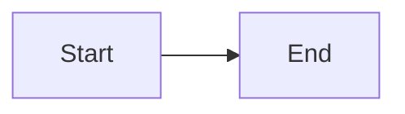
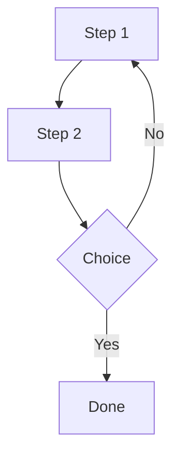
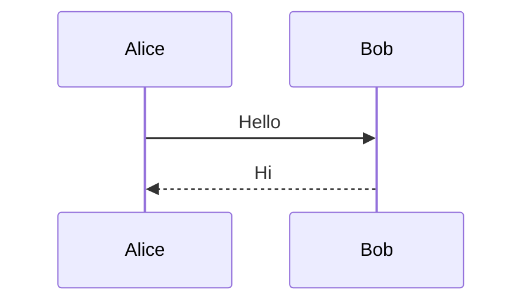

# Mermaid diagrams

[Mermaid](https://mermaid.js.org/) renders **diagrams from text** inside fenced code blocks with language `mermaid`. Below, each example shows the **source** (plain code block) and the **same diagram rendered** for reference.

## Basic usage

**Source** (what you type inside ` ```mermaid ` … ` ``` `):

```text
flowchart LR
  A[Start] --> B[End]
```

**Rendered:**



You can also show the fence in markdown as documentation:

````markdown

````

The diagram appears on the **wiki page** and in the **editor preview** when the fence is correct.

## Common diagram types

### Flowchart

**Source:**

```text
flowchart TD
  A[Step 1] --> B[Step 2]
  B --> C{Choice}
  C -->|Yes| D[Done]
  C -->|No| A
```

**Rendered:**



### Sequence diagram

**Source:**

```text
sequenceDiagram
  Alice->>Bob: Hello
  Bob-->>Alice: Hi
```

**Rendered:**



**Class / state / Gantt** — see the [Mermaid documentation](https://mermaid.js.org/) for syntax.

## Theme

Diagrams follow **light** or **dark** UI theme automatically.

## Exporting

On a rendered diagram, use the small **download** control (shown on hover) to save as **PNG** or **SVG**. You can choose **background** (white, black, transparent), **size** (pixel dimensions are shown per option), and **file type**.

## Tips

- Keep labels short; long text wraps inside nodes depending on diagram type.
- If a diagram fails to render, check the fence is exactly ` ```mermaid ` and closed with ` ``` `.
- Invalid syntax shows an error message in place of the diagram.

See also [Markdown help](/wiki/guides/help-markdown).
